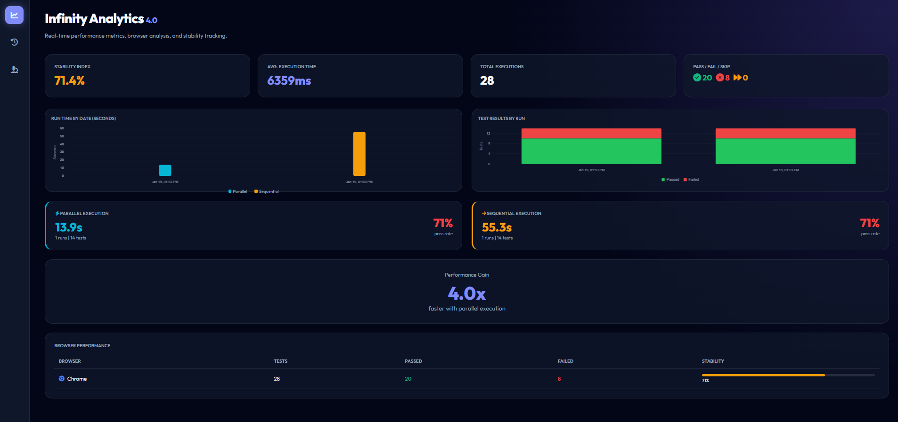
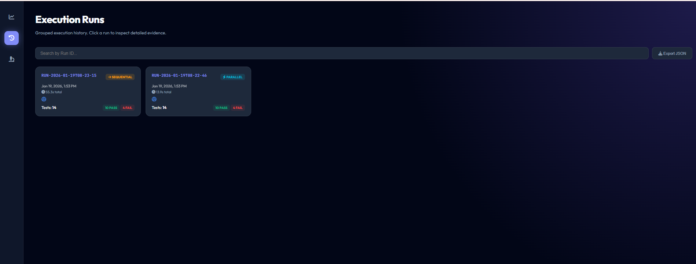
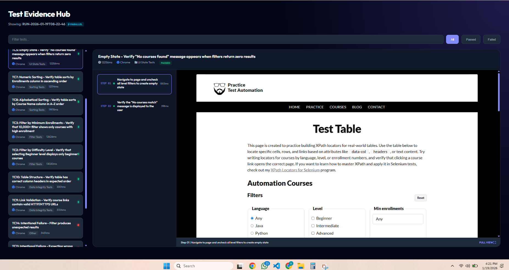
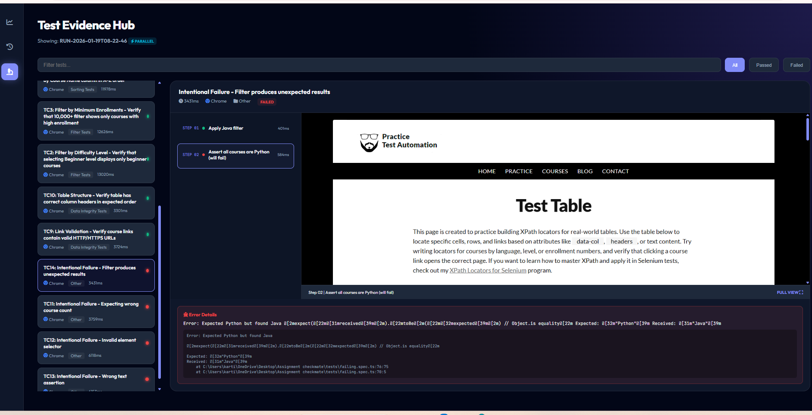

# Playwright Automation Framework

A robust, production-ready Playwright automation framework demonstrating test orchestration, visual evidence collection, and custom data persistence for long-term quality analytics.

## Dashboard Preview

The framework includes a custom-built **Infinity Analytics Dashboard** - a dark-themed, interactive HTML report that provides comprehensive insights into your test executions.

### Analytics Overview


The main analytics view displays key metrics at a glance:
- **Stability Index** - Overall pass rate across all test runs
- **Execution Time** - Average test duration tracking
- **Performance Comparison** - Side-by-side parallel vs sequential execution metrics with 4x speedup visualization
- **Interactive Charts** - Run time trends (cyan for parallel, orange for sequential) and pass/fail distribution
- **Browser Performance** - Per-browser stability tracking with progress indicators

### Execution Runs


The run history view provides:
- **Grouped Test Runs** - Each execution grouped by timestamp with unique Run ID
- **Execution Mode Badges** - Visual indicators for parallel or sequential runs
- **Quick Stats** - Pass/fail counts and total duration at a glance
- **Click to Inspect** - Navigate to detailed evidence for any run

### Test Evidence Hub - Passing Tests


The evidence viewer for passing tests shows:
- **Test List Panel** - All tests with status indicators and execution time
- **Step-by-Step Timeline** - Each test step with duration breakdown
- **Live Screenshots** - Visual evidence captured at every step
- **Filter Controls** - Quick filters for All/Passed/Failed tests

### Test Evidence Hub - Failed Tests


For failed tests, the dashboard provides:
- **Error Details Panel** - Full error message with stack trace
- **Screenshot at Failure Point** - Visual state when the test failed
- **Expected vs Received** - Clear diff showing assertion mismatches
- **File Location** - Direct links to failing test file and line number

---

## Features

- **TypeScript** with strict type checking
- **Page Object Model (POM)** design pattern
- **14 automated test cases** (10 passing + 4 intentional failures for demo)
- **Parallel & Sequential execution** modes
- **Custom Reporter** for persistent execution history
- **Interactive HTML Dashboard** with charts and evidence viewer
- **Automatic screenshot capture** for every test step
- **ESLint + Prettier** for code quality
- **Cross-browser support** (Chromium, Firefox, WebKit)

## Prerequisites

- Node.js 18+
- npm 9+

## Installation

```bash
# Install dependencies
npm install

# Install Playwright browsers
npx playwright install chromium firefox webkit
```

## Running Tests

```bash
# Run all tests in parallel (default - uses max workers)
npm run test:parallel

# Run all tests sequentially (single worker)
npm run test:sequential
```

## Generating Reports

After running tests, generate the HTML dashboard:

```bash
# Generate the dashboard report
npm run report:generate

# Open the dashboard in browser (Windows)
npm run report:open
```

The dashboard is generated at `output/dashboard.html` and includes:

- Pass/Fail distribution charts
- Execution performance trends
- Parallel vs Sequential comparison
- Detailed test history with step-by-step evidence
- Error details for failed tests

## Available Scripts

| Script                    | Description                                    |
| ------------------------- | ---------------------------------------------- |
| `npm run test:parallel`   | Run tests with parallel workers                |
| `npm run test:sequential` | Run tests with single worker                   |
| `npm run report:generate` | Generate HTML dashboard from execution history |
| `npm run report:open`     | Open the dashboard in default browser          |
| `npm run clean`           | Remove output and test-results folders         |
| `npm run lint`            | Run ESLint                                     |
| `npm run lint:fix`        | Fix ESLint issues automatically                |
| `npm run format`          | Format code with Prettier                      |
| `npm run format:check`    | Check code formatting                          |

## Project Structure

```
├── src/
│   ├── types/                    # TypeScript type definitions
│   │   ├── index.ts              # Main type exports
│   │   └── generics.ts           # Generic utility types
│   ├── constants/
│   │   └── selectors.ts          # Centralized DOM selectors
│   ├── data/
│   │   ├── index.ts              # Data layer barrel export
│   │   ├── enums.ts              # Enum definitions
│   │   └── test-data.ts          # Test data configurations
│   ├── pages/
│   │   ├── BasePage.ts           # Abstract base page class
│   │   └── TablePage.ts          # Table page object
│   └── utils/
│       ├── CustomReporter.ts     # Playwright custom reporter
│       └── WaitHelpers.ts        # Intelligent wait utilities
├── tests/
│   ├── assignment.spec.ts        # Main test suite (TC1-TC10)
│   └── failing.spec.ts           # Intentional failure demos (TC11-TC14)
├── scripts/
│   └── generate-report.ts        # Dashboard HTML generator
├── output/                       # Generated outputs (gitignored)
│   ├── dashboard.html            # Interactive HTML dashboard
│   ├── execution-history.json    # Persistent test history
│   ├── evidence/                 # Manual screenshots
│   └── screenshots/              # Archived step screenshots
├── playwright.config.ts          # Playwright configuration
├── tsconfig.json                 # TypeScript configuration
├── eslint.config.mjs             # ESLint flat config
├── .prettierrc                   # Prettier configuration
└── .gitignore                    # Git ignore rules
```

## Test Cases

### Main Test Suite (TC1-TC10)

| ID   | Category   | Description                                    |
| ---- | ---------- | ---------------------------------------------- |
| TC1  | Filter     | Filter by Programming Language (Java)          |
| TC2  | Filter     | Filter by Difficulty Level (Beginner)          |
| TC3  | Filter     | Filter by Minimum Enrollments (10,000+)        |
| TC4  | Filter     | Combined Filters (Python + Beginner + 10,000+) |
| TC5  | UI State   | Empty State - No courses found message         |
| TC6  | UI State   | Reset button clears filters                    |
| TC7  | Sorting    | Sort by Enrollments (ascending numeric)        |
| TC8  | Sorting    | Sort by Course Name (alphabetical)             |
| TC9  | Validation | Link Href validity check                       |
| TC10 | Validation | Table column headers verification              |

### Intentional Failure Tests (TC11-TC14)

| ID   | Description                        | Failure Type      |
| ---- | ---------------------------------- | ----------------- |
| TC11 | Expecting wrong course count       | Assertion failure |
| TC12 | Invalid element selector           | Timeout error     |
| TC13 | Wrong text assertion               | Text mismatch     |
| TC14 | Filter produces unexpected results | Logic failure     |

## Architecture

### Design Patterns

- **Page Object Model (POM)**: Encapsulates page interactions in dedicated classes
- **Base Page Pattern**: Common functionality inherited by all page objects
- **Custom Reporter Pattern**: Extends Playwright's reporter for persistent data

### SOLID Principles Applied

- **Single Responsibility**: Each class has one clear purpose
- **Open/Closed**: Extensible via BasePage inheritance
- **Liskov Substitution**: Page objects are interchangeable through base class
- **Interface Segregation**: Types are specific and focused
- **Dependency Inversion**: Abstractions over concrete implementations

### DRY Compliance

- Centralized selectors in `src/constants/selectors.ts`
- Shared functionality in `BasePage` class
- Type definitions reused across modules
- Test data configurations in `src/data/`

## Reporting Features

### Custom Reporter

- Captures test execution data in JSON format
- Archives screenshots to permanent locations
- Tracks browser, category, duration, and error details
- Supports retry tracking

### HTML Dashboard

- **Analytics Tab**: Pass rate, execution time, browser performance
- **Run History Tab**: Grouped execution runs with metadata
- **Test Evidence Tab**: Step-by-step screenshots with error details
- **Charts**: Run time comparison, pass/fail stacked bars
- **Export**: Download execution history as JSON

### Evidence Collection

- Automatic screenshot capture for every test step
- Screenshots archived to `output/screenshots/{runId}/`
- Full-page screenshots at 2x resolution (Retina)
- Error screenshots on failure

## Configuration

### Browser Projects

Edit `playwright.config.ts` to enable/disable browsers:

```typescript
projects: [
  { name: 'chromium', use: { ...devices['Desktop Chrome'] } },
  // { name: 'firefox', use: { ...devices['Desktop Firefox'] } },
  // { name: 'webkit', use: { ...devices['Desktop Safari'] } },
];
```

### Timeouts

Default timeouts are configured in `src/data/test-data.ts`:

```typescript
export const Timeouts = {
  visibility: 5000, // Element visibility
  filter: 3000, // Filter application
  sort: 2000, // Sort completion
  tableUpdate: 200, // Table DOM update
};
```

## Technology Stack

| Technology      | Version | Purpose                  |
| --------------- | ------- | ------------------------ |
| Node.js         | 18+     | Runtime environment      |
| Playwright Test | ^1.40.0 | Test framework           |
| TypeScript      | ^5.0.0  | Type-safe JavaScript     |
| ESLint          | ^9.39.2 | Code linting             |
| Prettier        | ^3.8.0  | Code formatting          |
| Chart.js        | CDN     | Dashboard visualizations |

## Troubleshooting

### Screenshots Not Visible in Dashboard

Ensure the dashboard is opened from the `output/` folder context. Screenshot paths are relative to `output/dashboard.html`.

### Tests Timing Out

1. Check network connectivity to the test site
2. Increase timeouts in `src/data/test-data.ts`
3. Run with `--debug` flag: `npx playwright test --debug`

### Report Generation Fails

1. Ensure tests have been run at least once
2. Check that `output/execution-history.json` exists
3. Run `npm run clean` and re-run tests
